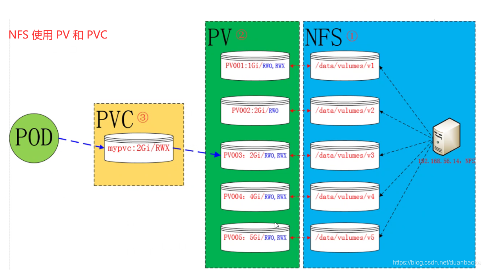

<font size=2>
PersistentVolume （PV）是外部存储系统中的一块存储空间，具有持久性，生命周期独立于Pod

PersistentVolumeClaim pvc 是对pv的申请（claim）。pvc通常由普通用户创建和维护

需要为pod分配存储资源时，用户可以创建一个pvc，指明存储资源的容量大小和访问模式（比如只读）等信息，kubernetes会查找并提供满足条件的pv

有了pvc，用户只需要告诉k8s需要什么样的存储资源，而不关心真正的空间从哪儿分配，如果访问等底层信息。这些 Storage Provider的底层信息交给管理员来处理，只有管理员才应该关心创建pv的细节信息。

pvc 和 pod类似，pod是消耗节点node资源，pvc消耗的是pv资源，pod可以请求cpu和内存，而pvc可以请求特定的存储空间和访问模式。

假如我们需要存储能力比较大存储资源，如果一个一个去对比pv，这样很消耗资源，这个时候引入了pvc，在创建pod的时候会附带一个pvc的请求，pvc的请求相当于就是去寻找一个合适的pv，进行绑定，这样我们的pod就会使用到这个pv了，也就是说让我们的pvc去寻找pv，而不是我们的pod资源去寻找

PVC若没有绑定会一直等待，直到符合条件的PV被创建

active 的 pv和pvc被删除时，pvc等不再被任何pod使用时删除，pv等不被任何pvc使用时

</font>

<font size=2 color=red>
storageClassName 指定pv的class为nfs，相当于为pv设置了一个分类，pvc可以指定class申请对应的class的pv，不写就在默认的class里面去找
</font><br/>

<font size=2>
    删除pvc之后，pv也会释放掉，从bound到released
</font>
```
[minikube@localhost ~]$ kubectl delete -f nginx-pvc-2g.yaml 
persistentvolumeclaim "nginx-pvc-2g" deleted
[minikube@localhost ~]$ 
[minikube@localhost ~]$ 
[minikube@localhost ~]$ kubectl get pv
NAME          CAPACITY   ACCESS MODES   RECLAIM POLICY   STATUS      CLAIM               STORAGECLASS   REASON   AGE
nginx-pv-1g   1Gi        RWX            Retain           Available                       nfs                     23h
nginx-pv-2g   2Gi        RWX            Retain           Released    test/nginx-pvc-2g   nfs                     23h
[minikube@localhost ~]$
```





---

<font color="#660000" size=4>注意创建pv，pvc时一定要带上storageClassName，否则创建后的pvc不会绑定到pv上</font>

##a. pvc去挂载pv

###1. 创建pv

```
accessModes:  
    ReadWriteOnce（RWO）：读写权限，并且只能被单个Node挂载。
    ReadOnlyMany（ROX）：只读权限，允许被多个Node挂载。
    ReadWriteMany（RWX）：读写权限，允许被多个Node挂载

回收策略（Reclaim Policy）
    指的是如果PVC被释放掉后，PV的处理，这里所说的释放，指的是用户删除PVC后，与PVC对应的PV会被释放掉，
    PVC和PV是一一对应的关系

persistentVolumeReclaimPolicy:
    Retain 保留：保留数据，需要手工处理。
    Recycle 回收空间：简单清除文件的操作（例如执行rm -rf /thevolume/* 命令）。
    Delete 删除：与PV相连的后端存储完成Volume的删除操作
```


```yaml
apiVersion: v1
kind: PersistentVolume
metadata:
  name: nginx-pv-1g
  namespace: test
spec:
  accessModes:
    - ReadWriteMany
  capacity:
    storage: 1Gi
  storageClassName: nfs
  nfs:
    path: /nfs/data/nginx
    server: 10.211.55.12

---

apiVersion: v1
kind: PersistentVolume
metadata:
  name: nginx-pv-2g
  namespace: test
spec:
  accessModes:
    - ReadWriteMany
  capacity:
    storage: 2Gi
  storageClassName: nfs
  nfs:
    path: /nfs/data/nginx-2g
    server: 10.211.55.12
```

###2. 创建pvc
```yaml
apiVersion: v1
kind: PersistentVolumeClaim
metadata:
  name: nginx-pvc-2g
  namespace: test
spec:
  accessModes:
    - ReadWriteMany
  resources:
    requests:
      storage: 2Gi
  storageClassName: nfs
```

###3. 创建deployment
```yaml
apiVersion: apps/v1
kind: Deployment
metadata:
  name: nginx
  namespace: test
spec:
  replicas: 2
  selector:
    matchLabels:
      app: nginx
  template:
    metadata:
      labels:
        app: nginx
    spec:
      containers:
      - image: nginx
        name: nginx-pvc
        ports:
        - containerPort: 80
        volumeMounts:
        - name: nginx-persistent-storage
          mountPath: /usr/share/nginx/html
      volumes:
      - name: nginx-persistent-storage
        persistentVolumeClaim:
          claimName: nginx-pvc-2g
```
也可以直接在 Deployment 中指定nfs挂载
```yaml
apiVersion: apps/v1
kind: Deployment
metadata:
  name: nginx-nfs
  namespace: test
spec:
  replicas: 2
  selector:
    matchLabels:
      app: nginx
  template:
    metadata:
      labels:
        app: nginx
    spec:
      containers:
      - image: nginx
        name: nginx-pvc
        ports:
        - containerPort: 80
        volumeMounts:
        - name: nginx-persistent-storage
          mountPath: /usr/share/nginx/html
      volumes:
      - name: nginx-persistent-storage
        nfs:
            server: 10.211.55.12
            path: /nfs/data/nginx
```

---

```console
[minikube@localhost ~]$ kubectl get pv -n test
NAME          CAPACITY   ACCESS MODES   RECLAIM POLICY   STATUS      CLAIM               STORAGECLASS   REASON   AGE
nginx-pv-1g   1Gi        RWX            Retain           Available                       nfs                     35s
nginx-pv-2g   2Gi        RWX            Retain           Bound       test/nginx-pvc-2g   nfs                     35s

[minikube@localhost ~]$ kubectl get pvc -n test
NAME           STATUS   VOLUME        CAPACITY   ACCESS MODES   STORAGECLASS   AGE
nginx-pvc-2g   Bound    nginx-pv-2g   2Gi        RWX            nfs            18s
```
可以看到 nginx-pv-2g 绑定了pvc -> test/nginx-pvc-2g ，因为pvc申请是2g的，pv也是2g的，直接绑定上


```
[minikube@localhost ~]$ kubectl exec -ti nginx-f476d5c74-hdcsv -n test sh
kubectl exec [POD] [COMMAND] is DEPRECATED and will be removed in a future version. Use kubectl kubectl exec [POD] -- [COMMAND] instead.
# ls /usr/share/nginx/html
index.html
# curl localhost
nginx-2g
```
可以看到已经挂载了nfs里面的nginx-2g目录下的文件


---


##b. pvc 去挂载 storageClass 
StorageClass是一个找不到合适pv之后可以自动创建的pv的一个机制
storageClass用来创建pvc需要的pv，由provisioner组件动态创建

在实际工作中，使用StorageClass更多的是StatefulSet类型的服务，StatefulSet类型的服务也可以通过一个 volumeClaimTemplates属性来直接使用 StorageClass

自动创建的 PV 以${namespace}-${pvcName}-${pvName}这样的命名格式创建在 NFS 服务器上的共享数据目录中
而当这个 PV 被回收后会以archieved-${namespace}-${pvcName}-${pvName}这样的命名格式存在 NFS 服务器上

因为statefulSet有状态的服务，pod名字也会是固定的


